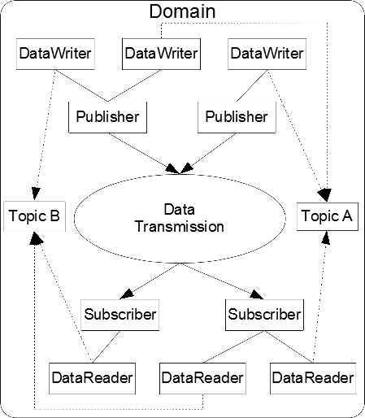
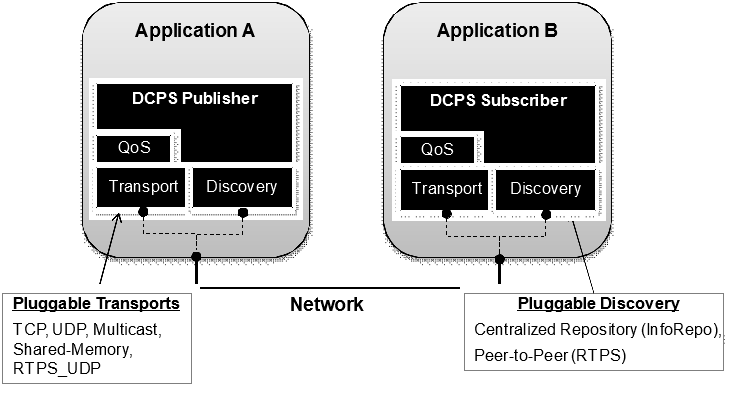
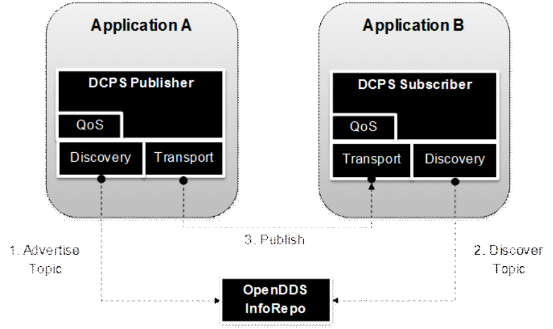
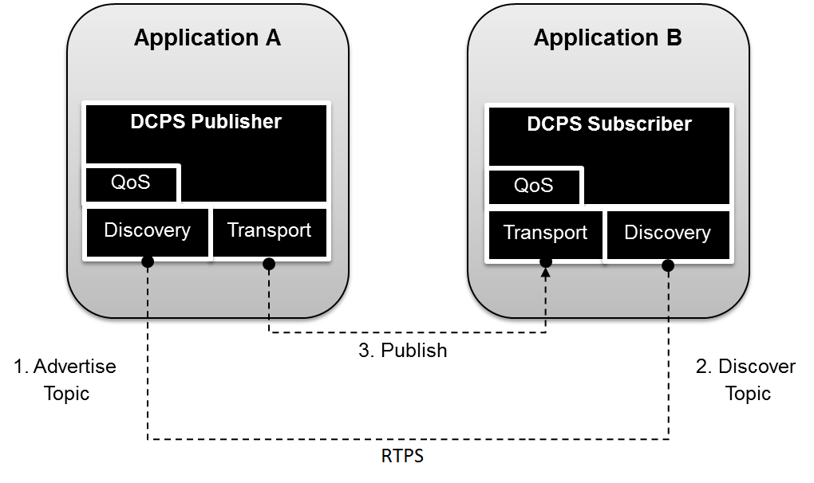

.. _1:

############
Introduction
############

OpenDDS is an open source implementation of the OMG Data Distribution Service (DDS) for Real-Time Systems Specification v1.4 (OMG Document ``formal/2015-04-10``) and the Real-time Publish-Subscribe Wire Protocol DDS Interoperability Wire Protocol Specification (DDSI-RTPS) v2.3 (OMG Document ``formal/2019-04-03``).
OpenDDS also implements the DDS Security Specification v1.1 (OMG Document ``formal/2018-04-01``) and DDS XTypes v1.3 (OMG Document ``formal/2020-02-04``).
OpenDDS is sponsored by Object Computing, Inc. (OCI) and is available at http://www.opendds.org/.
This developer’s guide is based on the version 3.16 release of OpenDDS.

DDS defines a service for efficiently distributing application data between participants in a distributed application.
This service is not tied to CORBA.
The specification provides a Platform Independent Model (PIM) as well as a Platform Specific Model (PSM) that maps the PIM onto an OMG IDL implementation.

For additional details about DDS, developers should refer to the DDS specification (OMG Document ``formal/2015-04-10``) as it contains in-depth coverage of all the service’s features.

OpenDDS is the open-source C++ implementation of OMG’s DDS specification developed and commercially supported by Object Computing, Inc. (OCI).
It is available for download from http://www.opendds.org/downloads.html and is compatible with the latest patch level of OCI TAO version 2.2a (includes ACE), and the latest DOC Group release of ACE+TAO in the ACE 6.x / TAO 2.x series.

.. note:: OpenDDS currently implements the OMG DDS version 1.4 specification.
  See the compliance information in or at http://www.opendds.org/ for more information.

.. _1.1:

*************
DCPS Overview
*************

In this section we introduce the main concepts and entities of the DCPS layer and discuss how they interact and work together.

.. _1.1.1:

Basic Concepts
==============

Figure 1-1 shows an overview of the DDS DCPS layer.
The following subsections define the concepts shown in this diagram.

**Figure 1-1 DCPS Conceptual Overview**

.. _1.1.1.1:

Domain
------

The *domain* is the fundamental partitioning unit within DCPS.
Each of the other entities belongs to a domain and can only interact with other entities in that same domain.
Application code is free to interact with multiple domains but must do so via separate entities that belong to the different domains.

.. _1.1.1.2:

DomainParticipant
-----------------

A *domain participant* is the entry-point for an application to interact within a particular domain.
The domain participant is a factory for many of the objects involved in writing or reading data.

.. _1.1.1.3:

Topic
-----

The *topic* is the fundamental means of interaction between publishing and subscribing applications.
Each topic has a unique name within the domain and a specific data type that it publishes.
Each topic data type can specify zero or more fields that make up its *key*.
When publishing data, the publishing process always specifies the topic.
Subscribers request data via the topic.
In DCPS terminology you publish individual data *samples* for different *instances* on a topic.
Each instance is associated with a unique value for the key.
A publishing process publishes multiple data samples on the same instance by using the same key value for each sample.

.. _1.1.1.4:

DataWriter
----------

The *data writer* is used by the publishing application code to pass values to the DDS.
Each data writer is bound to a particular topic.
The application uses the data writer’s type-specific interface to publish samples on that topic.
The data writer is responsible for marshaling the data and passing it to the publisher for transmission.

.. _1.1.1.5:

Publisher
---------

The *publisher* is responsible for taking the published data and disseminating it to all relevant subscribers in the domain.
The exact mechanism employed is left to the service implementation.

.. _1.1.1.6:

Subscriber
----------

The *subscriber* receives the data from the publisher and passes it to any relevant data readers that are connected to it.

.. _1.1.1.7:

DataReader
----------

The *data reader* takes data from the subscriber, demarshals it into the appropriate type for that topic, and delivers the sample to the application.
Each data reader is bound to a particular topic.
The application uses the data reader’s type-specific interfaces to receive the samples.

.. _1.1.2:

Built-In Topics
===============

The DDS specification defines a number of topics that are built-in to the DDS implementation.
Subscribing to these *built-in topics* gives application developers access to the state of the domain being used including which topics are registered, which data readers and data writers are connected and disconnected, and the QoS settings of the various entities.
While subscribed, the application receives samples indicating changes in the entities within the domain.

The following table shows the built-in topics defined within the DDS specification:

**Table 1-1 Built-in Topics**

+----------------------+---------------------------------------------------------+
| Topic Name           | Description                                             |
+======================+=========================================================+
| ``DCPSParticipant``  | Each instance represents a domain participant.          |
+----------------------+---------------------------------------------------------+
| ``DCPSTopic``        | Each instance represents a normal (not built-in) topic. |
+----------------------+---------------------------------------------------------+
| ``DCPSPublication``  | Each instance represents a data writer.                 |
+----------------------+---------------------------------------------------------+
| ``DCPSSubscription`` | Each instance represents a data reader.                 |
+----------------------+---------------------------------------------------------+

.. _1.1.3:

Quality of Service Policies
===========================

The DDS specification defines a number of Quality of Service (QoS) policies that are used by applications to specify their QoS requirements to the service.
Participants specify what behavior they require from the service and the service decides how to achieve these behaviors.
These policies can be applied to the various DCPS entities (topic, data writer, data reader, publisher, subscriber, domain participant) although not all policies are valid for all types of entities.

Subscribers and publishers are matched using a request-versus-offered (RxO) model.
Subscribers *request* a set of policies that are minimally required.
Publishers *offer* a set of QoS policies to potential subscribers.
The DDS implementation then attempts to match the requested policies with the offered policies; if these policies are compatible then the association is formed.

The QoS policies currently implemented by OpenDDS are discussed in detail in Chapter 3.

.. _1.1.4:

Listeners
=========

The DCPS layer defines a callback interface for each entity that allows an application processes to “listen” for certain state changes or events pertaining to that entity.
For example, a Data Reader Listener is notified when there are data values available for reading.

.. _1.1.5:

Conditions
==========

*Conditions* and *Wait Sets* allow an alternative to listeners in detecting events of interest in DDS.
The general pattern is

The application creates a specific kind of ``Condition`` object, such as a ``StatusCondition``, and attaches it to a ``WaitSet``.

* The application waits on the ``WaitSet`` until one or more conditions become true.

* The application calls operations on the corresponding entity objects to extract the necessary information.

* The ``DataReader`` interface also has operations that take a ``ReadCondition`` argument.

* ``QueryCondition`` objects are provided as part of the implementation of the Content-Subscription Profile.
  The ``QueryCondition`` interface extends the ``ReadCondition`` interface.

.. _1.2:

**********************
OpenDDS Implementation
**********************

.. _1.2.1:

Compliance
==========

OpenDDS complies with the OMG DDS and the OMG DDSI-RTPS specifications.
Details of that compliance follows here.
OpenDDS also implements the OMG DDS Security specification.
Details of compliance to that specification are in section :ref:`14.8`.
Details of XTypes compliance are in sections :ref:`16.6` and :ref:`16.7`.

.. _1.2.1.1:

DDS Compliance
--------------

Section 2 of the DDS specification defines five compliance points for a DDS implementation:

* Minimum Profile

* Content-Subscription Profile

* Persistence Profile

* Ownership Profile

* Object Model Profile

OpenDDS complies with the entire DDS specification (including all optional profiles).
This includes the implementation of all Quality of Service policies with the following notes:

* RELIABILITY.kind = RELIABLE is supported by the RTPS_UDP transport, the TCP transport, or the IP Multicast transport (when configured as reliable).

* TRANSPORT_PRIORITY is not implemented as changeable.

Although version 1.5 of the DDS specification is not yet published, OpenDDS incorporates some changes planned for that version that are required for a robust implementation:

* DDS15-257: The IDL type BuiltinTopicKey_t is a struct containing an array of 16 octets

.. _1.2.1.2:

DDSI-RTPS Compliance
--------------------

The OpenDDS implementation complies with the requirements of the OMG DDSI-RTPS specification.

.. _1.2.1.2.1:

OpenDDS RTPS Implementation Notes
^^^^^^^^^^^^^^^^^^^^^^^^^^^^^^^^^

The OMG DDSI-RTPS specification (formal/2019-04-03) supplies statements for implementation, but not required for compliance.
The following items should be taken into consideration when utilizing the OpenDDS RTPS functionality for transport and/or discovery.
Section numbers of the DDSI-RTPS specification are supplied with each item for further reference.

Items not implemented in OpenDDS:

#. Writer-side content filtering (8.7.3)OpenDDS may still drop samples that aren't needed (due to content filtering) by any associated readers — this is done above the transport layer

#. Coherent sets for ``PRESENTATION`` QoS (8.7.5)

#. Directed writes (8.7.6)

   * OpenDDS will use the Directed Write parameter if it’s present on incoming messages (for example, messages generated by a different DDS implementation)

#. Property lists (8.7.7)

#. Original writer info for ``DURABLE`` data (8.7.8) -- this would only be used for transient and persistent durability, which are not supported by the RTPS specification (8.7.2.2.1)

#. Key Hashes (8.7.9) are not generated, but they are optional

#. ``nackSuppressionDuration`` (Table 8.47) and ``heartbeatSuppressionDuration`` (Table 8.62).

.. note:: Items 3 and 4 above are described in the DDSI-RTPS specification.
  However, they do not have a corresponding concept in the DDS specification.

.. _1.2.1.3:

IDL Compliance
--------------

OMG IDL is used in a few different ways in the OpenDDS code base and downstream applications that use it:

* Files that come with OpenDDS such as ``dds/DdsDcpsTopic.idl`` define parts of the API between the middleware libraries and the application.
  This is known as the OMG IDL Platform Specific Model (PSM).

* Users of OpenDDS author IDL files in addition to source code files in C++ or Java.

This section only describes the latter use.

The IDL specification (version 4.2) uses the term “building block” to define subsets of the overall IDL grammar that may be supported by certain tools.
OpenDDS supports the following building blocks, with notes/caveats listed below each:

* Core Data Types

  * Support for the “fixed” data type (fixed point decimal) is incomplete.

* Anonymous Types

  * There is limited support for anonymous types when they appear as sequence/array instantiations directly as struct field types.
    Using an explicitly-named type is recommended.

* Annotations

  * See sections :ref:`2.1.1` and :ref:`16.5` for details on which built-in annotations are supported.

  * User-defined annotation types are also supported.

.. _1.2.2:

Extensions to the DDS Specification
===================================

Data types, interfaces, and constants in the **DDS** IDL module (C++ namespace, Java package) correspond directly to the DDS specification with very few exceptions:

* DDS::SampleInfo contains an extra field starting with “opendds_reserved”

* Type-specific DataReaders (including those for Built-in Topics) have additional operations read_instance_w_condition() and take_instance_w_condition().

Additional extended behavior is provided by various classes and interfaces in the OpenDDS module/namespace/package.
Those include features like Recorder and Replayer (see chapter :ref:`12`) and also:

* OpenDDS::DCPS::TypeSupport adds the unregister_type() operation not found in the DDS spec.

* OpenDDS::DCPS::ALL_STATUS_MASK, NO_STATUS_MASK, and DEFAULT_STATUS_MASK are useful constants for the DDS::StatusMask type used by DDS::Entity, DDS::StatusCondition, and the various create_*() operations.

.. _1.2.3:

OpenDDS Architecture
====================

This section gives a brief overview of the OpenDDS implementation, its features, and some of its components.
The ``$DDS_ROOT`` environment variable should point to the base directory of the OpenDDS distribution.
Source code for OpenDDS can be found under the ``$DDS_ROOT/dds/`` directory.
DDS tests can be found under ``$DDS_ROOT/tests``/.

.. _1.2.3.1:

Design Philosophy
-----------------

The OpenDDS implementation and API is based on a fairly strict interpretation of the OMG IDL PSM.
In almost all cases the OMG’s IDL-to-C++ Language Mapping is used to define how the IDL in the DDS specification is mapped into the C++ APIs that OpenDDS exposes to the client.

The main deviation from the OMG IDL PSM is that local interfaces are used for the entities and various other interfaces.
These are defined as unconstrained (non-local) interfaces in the DDS specification.
Defining them as local interfaces improves performance, reduces memory usage, simplifies the client’s interaction with these interfaces, and makes it easier for clients to build their own implementations.

.. _1.2.3.2:

Extensible Transport Framework (ETF)
------------------------------------

OpenDDS uses the IDL interfaces defined by the DDS specification to initialize and control service usage.
Data transmission is accomplished via an OpenDDS-specific transport framework that allows the service to be used with a variety of transport protocols.
This is referred to as *pluggable transports* and makes the extensibility of OpenDDS an important part of its architecture.
OpenDDS currently supports TCP/IP, UDP/IP, IP multicast, shared-memory, and RTPS_UDP transport protocols as shown in Figure 1-2.
Transports are typically specified via configuration files and are attached to various entities in the publisher and subscriber processes.
Refer to Section 7.4.4 for details on configuring ETF components.

**Figure 1-2 OpenDDS Extensible Transport Framework**

The ETF enables application developers to implement their own customized transports.
Implementing a custom transport involves specializing a number of classes defined in the transport framework.
The ``udp`` transport provides a good foundation developers may use when creating their own implementation.
See the ``$DDS_ROOT/dds/DCPS/transport/udp/`` directory for details.

.. _1.2.3.3:

DDS Discovery
-------------

DDS applications must discover one another via some central agent or through some distributed scheme.
An important feature of OpenDDS is that DDS applications can be configured to perform discovery using the DCPSInfoRepo or RTPS discovery, but utilize a different transport type for data transfer between data writers and data readers.
The OMG DDS specification (``formal/2015-04-10``) leaves the details of discovery to the implementation.
In the case of interoperability between DDS implementations, the OMG DDSI-RTPS ``(formal/2014-09-01)`` specification provides requirements for a peer-to-peer style of discovery.

OpenDDS provides two options for discovery.

#. Information Repository: a centralized repository style that runs as a separate process allowing publishers and subscribers to discover one another centrally or

#. RTPS Discovery: a peer-to-peer style of discovery that utilizes the RTPS protocol to advertise availability and location information.

Interoperability with other DDS implementations must utilize the peer-to-peer method, but can be useful in OpenDDS-only deployments.

.. _1.2.3.3.1:

Centralized Discovery with DCPSInfoRepo
^^^^^^^^^^^^^^^^^^^^^^^^^^^^^^^^^^^^^^^

OpenDDS implements a standalone service called the DCPS Information Repository (DCPSInfoRepo) to achieve the centralized discovery method.
It is implemented as a CORBA server.
When a client requests a subscription for a topic, the DCPS Information Repository locates the topic and notifies any existing publishers of the location of the new subscriber.
The DCPSInfoRepo process needs to be running whenever OpenDDS is being used in a non-RTPS configuration.
An RTPS configuration does not use the DCPSInfoRepo.
The DCPSInfoRepo is not involved in data propagation, its role is limited in scope to OpenDDS applications discovering one another.

**Figure 1-3: Centralized Discovery with OpenDDS InfoRepo**

Application developers are free to run multiple information repositories with each managing their own non-overlapping sets of DCPS domains.

It is also possible to operate domains with more than a single repository, thus forming a distributed virtual repository.
This is known as *Repository Federation*.
In order for individual repositories to participate in a federation, each one must specify its own federation identifier value (a 32-bit numeric value) upon start-up.
See :ref:`9.2` for further information about repository federations.

.. _1.2.3.3.2:

Peer-to-Peer Discovery with RTPS
^^^^^^^^^^^^^^^^^^^^^^^^^^^^^^^^

DDS applications requiring a Peer-to-Peer discovery pattern can be accommodated by OpenDDS capabilities.
This style of discovery is accomplished only through the use of the RTPS protocol as of the current release.
This simple form of discovery is accomplished through simple configuration of DDS application data readers and data writers running in application processes as shown in Figure 1-4.
As each participating process activates the DDSI-RTPS discovery mechanisms in OpenDDS for their data readers and writers, network endpoints are created with either default or configured network ports such that DDS participants can begin advertising the availability of their data readers and data writers.
After a period of time, those seeking one another based on criteria will find each other and establish a connection based on the configured pluggable transport as discussed in Extensible Transport Framework (ETF).
A more detailed description of this flexible configuration approach is discussed in Section :ref:`7.4.1.1` and Section :ref:`7.4.5.5`.

**Figure 1-4: Peer-to-peer Discovery with RTPS**

The following are additional implementation limits that developers need to take into consideration when developing and deploying applications that use RTPS discovery:

#. Domain IDs should be between 0 and 231 (inclusive) due to the way UDP ports are assigned to domain IDs.
   In each OpenDDS process, up to 120 domain participants are supported in each domain.

#. Topic names and type identifiers are limited to 256 characters.

#. OpenDDS's native multicast transport does not work with RTPS Discovery due to the way GUIDs are assigned (a warning will be issued if this is attempted).

For more details in how RTPS discovery occurs, a very good reference to read can be found in Section 8.5 of the Real-time Publish-Subscribe Wire Protocol DDS Interoperability Wire Protocol Specification (DDSI-RTPS) v2.2 (OMG Document ``formal/2014-09-01``).

.. _1.2.3.4:

Threading
---------

OpenDDS creates its own ORB (when one is required) as well as a separate thread upon which to run that ORB.
It also uses its own threads to process incoming and outgoing transport I/O.
A separate thread is created to cleanup resources upon unexpected connection closure.
Your application may get called back from these threads via the Listener mechanism of DCPS.

When publishing a sample via DDS, OpenDDS normally attempts to send the sample to any connected subscribers using the calling thread.
If the send call blocks, then the sample may be queued for sending on a separate service thread.
This behavior depends on the QoS policies described in Chapter 3.

All incoming data in the subscriber is read by a service thread and queued for reading by the application.
DataReader listeners are called from the service thread.

.. _1.2.3.5:

Configuration
-------------

OpenDDS includes a file-based configuration framework for configuring both global items such as debug level, memory allocation, and discovery, as well as transport implementation details for publishers and subscribers.
Configuration can also be achieved directly in code, however, it is recommended that configuration be externalized for ease of maintenance and reduction in runtime errors.
The complete set of configuration options are described in Chapter 7.

.. _1.3:

************
Installation
************

The steps on how to build OpenDDS can be found in ``$DDS_ROOT/INSTALL.md``.

To build OpenDDS with DDS Security, see section :ref:`14.1` below.

To avoid compiling OpenDDS code that you will not be using, there are certain features than can be excluded from being built.
The features are discussed below.

Users requiring a small-footprint configuration or compatibility with safety-oriented platforms should consider using the OpenDDS Safety Profile, which is described in chapter :ref:`13` of this guide.

.. _1.3.1:

Building With a Feature Enabled or Disabled
===========================================

Most features are supported by the *configure*script.
The *configure* script creates config files with the correct content and then runs MPC.
If you are using the *configure* script, run it with the “--help” command line option and look for the feature you wish to enable/disable.
If you are not using the *configure*script, continue reading below for instructions on running MPC directly.

For the features described below, MPC is used for enabling (the default) a feature or disabling the feature.
For a feature named *feature*, the following steps are used to disable the feature from the build:

#. Use the command line “features” argument to MPC:``mwc.pl -type <type> -featuresfeature=0 DDS.mwc`` Or alternatively, add the line ``feature=0`` to the file ``$ACE_ROOT/bin/MakeProjectCreator/config/default.features`` and regenerate the project files using MPC.

#. If you are using the ``gnuace`` MPC project type (which is the case if you will be using GNU make as your build system), add line “``feature=0``” to the file ``$ACE_ROOT/include/makeinclude/platform_macros.GNU``.

To explicitly enable the feature, use ``feature=1`` above.

.. note:: You can also use the ``$DDS_ROOT/configure`` script to enable or disable features.
  To disable the feature, pass ``--no-feature`` to the script, to enable pass ``--feature``.
  In this case ‘``-``’ is used instead of ‘``_``’ in the feature name.
  For example, to disable feature ``content_subscription`` discussed below, pass ``--no-content-subscription`` to the configure script.

.. _1.3.2:

Disabling the Building of Built-In Topic Support
================================================

Feature Name: ``built_in_topics``

You can reduce the footprint of the core DDS library by up to 30% by disabling Built-in Topic Support.
See Chapter :ref:`6` for a description of Built-In Topics.

.. _1.3.3:

Disabling the Building of Compliance Profile Features
=====================================================

The DDS specification defines *compliance profiles* to provide a common terminology for indicating certain feature sets that a DDS implementation may or may not support.
These profiles are given below, along with the name of the MPC feature to use to disable support for that profile or components of that profile.

Many of the profile options involve QoS settings.
If you attempt to use a QoS value that is incompatible with a disabled profile, a runtime error will occur.
If a profile involves a class, a compile time error will occur if you try to use the class and the profile is disabled.

.. _1.3.3.1:

Content-Subscription Profile
----------------------------

Feature Name: ``content_subscription``

This profile adds the classes ``ContentFilteredTopic``, ``QueryCondition``, and ``MultiTopic`` discussed in Chapter 5.

In addition, individual classes can be excluded by using the features given in the table below.

**Table 1-2: Content-Subscription Class Features**

+----------------------+----------------------------+
| Class                | Feature                    |
+======================+============================+
| ContentFilteredTopic | ``content_filtered_topic`` |
+----------------------+----------------------------+
| QueryCondition       | ``query_condition``        |
+----------------------+----------------------------+
| MultiTopic           | ``multi_topic``            |
+----------------------+----------------------------+

.. _1.3.3.2:

Persistence Profile
-------------------

Feature Name: ``persistence_profile``

This profile adds the QoS policy ``DURABILITY_SERVICE`` and the settings ‘``TRANSIENT``’ and ‘``PERSISTENT``’ of the ``DURABILITY`` QoS policy ``kind``.

.. _1.3.3.3:

Ownership Profile
-----------------

Feature Name: ``ownership_profile``

This profile adds:

* the setting ‘``EXCLUSIVE``’ of the ``OWNERSHIP`` ``kind``

* support for the ``OWNERSHIP_STRENGTH`` policy

* setting a ``depth > 1`` for the ``HISTORY`` QoS policy.

.. note:: Some users may wish to exclude support for the Exclusive OWNERSHIP policy and its associated OWNERSHIP_STRENGTH without impacting use of HISTORY.
  In order to support this configuration, OpenDDS also has the MPC feature ownership_kind_exclusive (configure script option --no-ownership-kind-exclusive).

.. _1.3.3.4:

Object Model Profile
--------------------

Feature Name: ``object_model_profile``

This profile includes support for the ``PRESENTATION`` access_scope setting of ‘``GROUP``’.

.. note:: Currently, the ``PRESENTATION`` access_scope of ‘``TOPIC``’ is also excluded when ``object_model_profile`` is disabled.

.. _1.4:

**************************************
Building Applications that use OpenDDS
**************************************

This section applies to any C++ code that directly or indirectly includes OpenDDS headers.
For Java applications, see Chapter :ref:`10` below.

C++ source code that includes OpenDDS headers can be built using either build system: MPC or CMake.

.. _1.4.1:

MPC: The Makefile, Project, and Workspace Creator
=================================================

OpenDDS is itself built with MPC, so development systems that are set up to use OpenDDS already have MPC available.
The OpenDDS configure script creates a “setenv” script with environment settings (``setenv.cmd`` on Windows; ``setenv.sh`` on Linux/macOS).
This environment contains the ``PATH`` and ``MPC_ROOT`` settings necessary to use MPC.

MPC’s source tree (in ``MPC_ROOT``) contains a “docs” directory with both HTML and plain text documentation (``USAGE`` and ``README`` files).

The example walk-through in section :ref:`2.1` uses MPC as its build system.
The OpenDDS source tree contains many tests and examples that are built with MPC.
These can be used as starting points for application MPC files.

.. _1.4.2:

CMake
=====

Applications can also be built with CMake (`https:// <https://cmake.org/>`_`cmake.org <https://cmake.org/>`_).
See the included documentation in the OpenDDS source tree: ``docs/cmake.md``

The OpenDDS source tree also includes examples of using CMake.
They are listed in the ``cmake.md`` file.

.. _1.4.3:

Custom Build systems
====================

Users of OpenDDS are strongly encouraged to select one of the two options listed above (MPC or CMake) to generate consistent build files on any supported platform.
If this is not possible, users of OpenDDS must make sure that all code generator, compiler, and linker settings in the custom build setup result in API- and ABI-compatible code.
To do this, start with an MPC or CMake-generated project file (makefile or Visual Studio project file) and make sure all relevant settings are represented in the custom build system.
This is often done through a combination of inspecting the project file and running the build with verbose output to see how the toolchain (code generators, compiler, linker) is invoked.
Contact Object Computing, Inc. (OCI) via https://objectcomputing.com/products/opendds/consulting-support to have our expert software engineers work on this for you.

